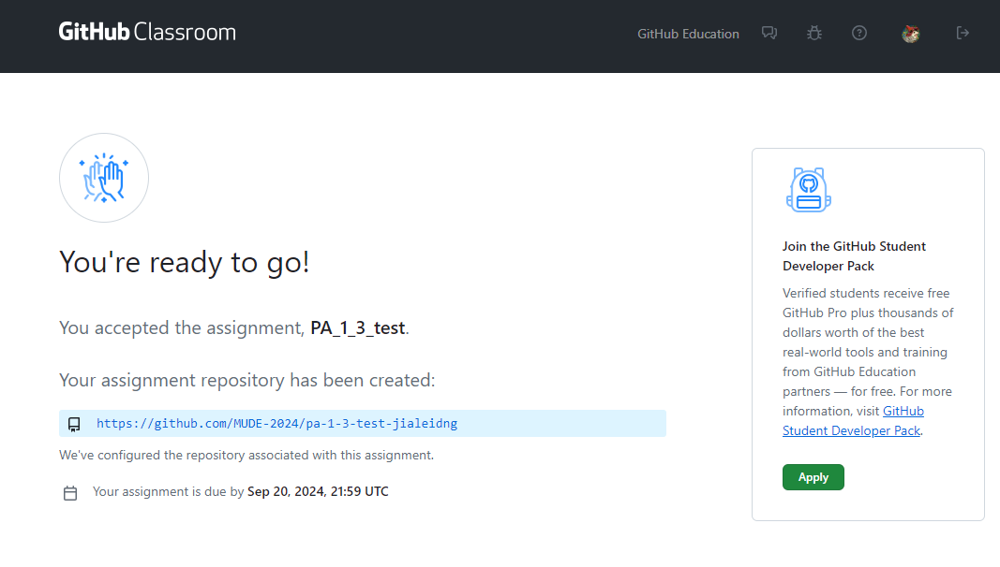
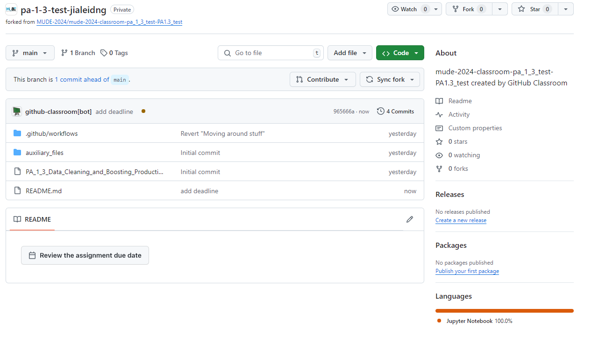
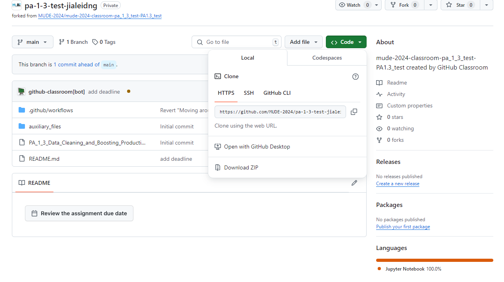
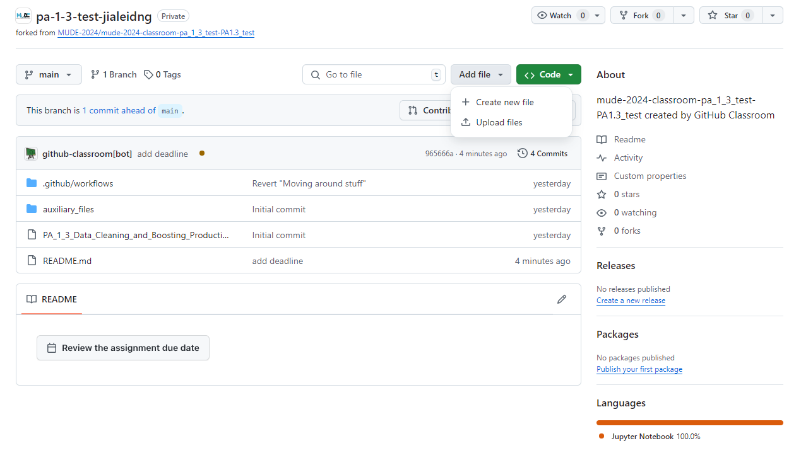
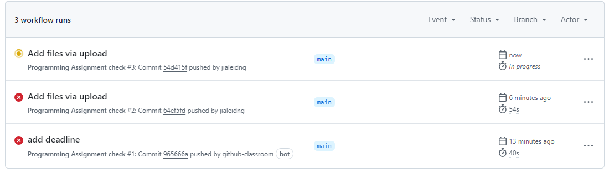
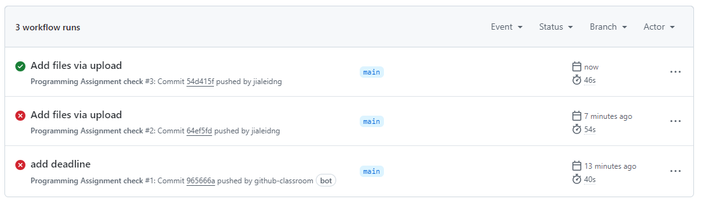
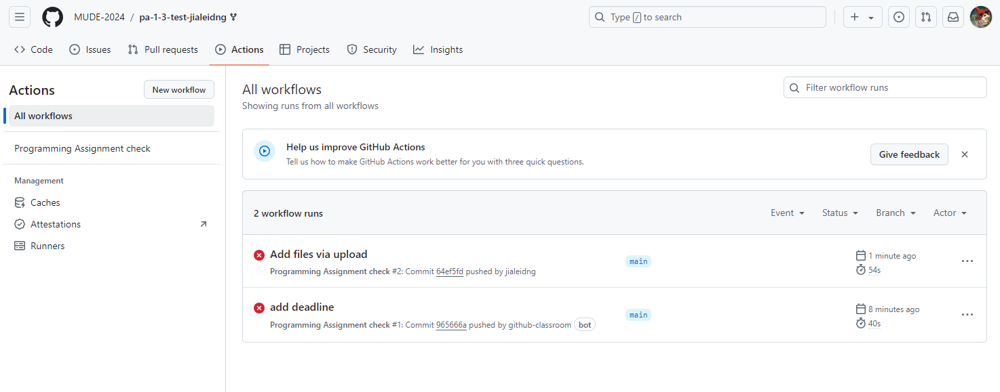

# PA 1: Our First Programming Assignment

*[MUDE in Madras](https://tudelft-mude.github.io/workshop-iitm/): Week 1. Due by November 27, 2024.*

_You can access this assignment with the following link: [classroom.github.com/a/S1jsupjT](https://classroom.github.com/a/S1jsupjT)._

This PA consists of the following files:
- `PA_1_.useful_tricks.ipynb`: a Jupyter notebook covering a few simple Python topics that are especially useful for the assignments in MUDE, as well as a plotting technique that is useful for our numerical integration topic.
- an empty file `myfigure.md` and subdirectory `figures/` which are needed for this assginment
- a subdirectory `auxiliary_files/` containing figures for the GitHub assignment instructions below
- a file `environment.yml` to set up a Python environment (optional)
- a few extra hidden files and folders (starting with `.`) to make the assignment go smoothly

## Grading Criteria

You will pass this PA if:
1. Your notebook `PA_1_useful_tricks.ipynb` runs without errors.
2. Your repository contains a file `my_figure.svg` located in subdirectory `./figures`
3. You update the `myfigure.md` file to include a reference to the previous figure.

You can verify that you passed by looking for the green circle in this repository, which runs automatically when you uploaded your notebook (explained below).

## Using Python with the Notebook

If you have trouble running the Jupyter notebook, you may want to create a Python environment. You can do this by opening a command line interface (CLI), navigate to this working directory, then run the following command:

```
conda env create -f environment.yml
```

Once the packages are installed, test that it is created successfully by executing:

```
conda activate iitm-base
```

When using the notebook in VS Code, you should select this as your Python environment.

## How to Access the Assignment

Once you have a GitHub account, you are able to Access the assignment by clicking on the GitHub classroom link and following the steps described below:

1. Click the link
2. Authorize GitHub Access
3. Join the classroom and identify yourself by finding your Student ID Number in the list of "Identifiers". If your ID is not there, you can "skip this step" (username will be used for repo name)
4. Click "Accept this assignment"
5. you will see a link that looks like this: `http://github.com/MUDE-2024/....` save the link or bookmark it so you can find it later, then click on the link



You have now opened up a repository on GitHub. We will learn more about Git, GitHub and repositories next week. For now, we will simply be using it as a place to download and upload files (and check that your notebook has passed).

To work on the assignment, you are expected to first **download** the files, then work in the notebook. When you have finished the activities, save your work in VS Code, then proceed to the next section (submitting the assignment).



To **download** the assignment:

1. Click the green "Code" button
2. At the bottom of the popup window, select "Download ZIP"
3. Unzip the file on your computer; the unzipped folder will be your working directory for PA 1.3 and contains all necessary files.



## How to Submit the Assignment

To submit your notebook, return to the repository using the link you saved above when accepting it. Then:

1. Click the "Add file" button and then select "Upload Files"
2. Drag the file you changed (should be the notebook) to the appropriate box, or find it using the "Browse" feature.
3. Once the file is there you don't have to edit any text (e.g., the commit messages)
4. Simply click the green "Commit Changes" button.
5. That's it!




## How to Check that your Notebook Passed

To see if your notebook passed:

1. Start in the home page of your PA 1.3 repository (should be taken there automatically after you submit the file).
2. Click on the "Actions" tab near the top center of the page.
3. If you recently uploaded a file you should see a yellow dot. This means your submission is being checked; it will change after the checking process is completed.



If the dot turns green, your notebook passes.



If the dot turns red with an "x" it means your notebook does not meet the requirements. If this happens, you should check your notebook (on your computer) for errors and re-submit it using the process described above.




**End of file.**

<span style="font-size: 75%">
&copy; Copyright 2024 <a rel="MUDE" href="http://mude.citg.tudelft.nl/">MUDE</a>, TU Delft. This work is licensed under a <a rel="license" href="http://creativecommons.org/licenses/by/4.0/">CC BY 4.0 License</a>.